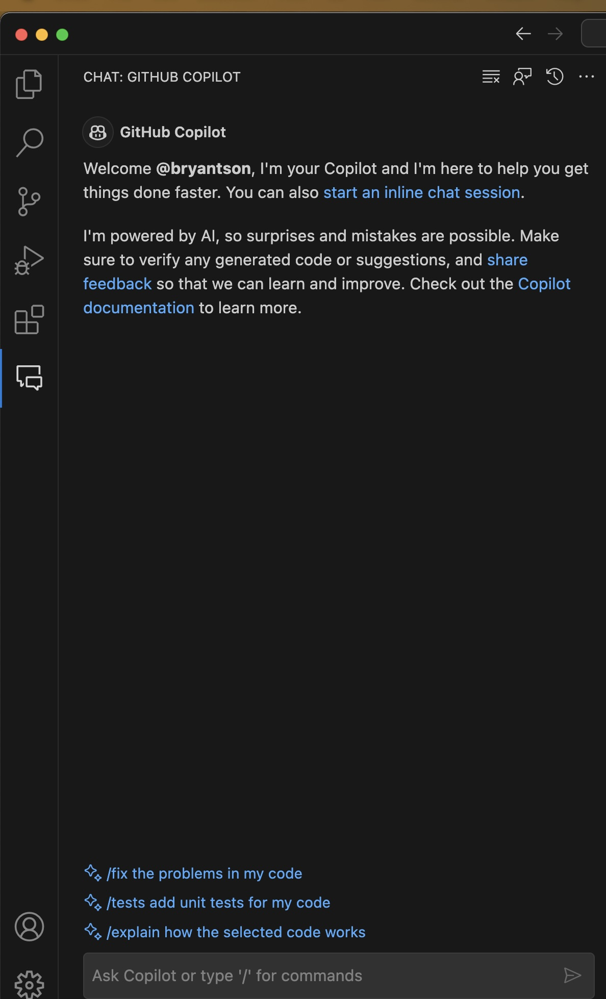

# How to build a fun NodeJS application that executes shell commands in a browser

A small demo project to exercise the basic capabilities of Copilot in ***Visual Studio Code***. In this demo you should refine JavaScript coding a Node based calculator Module that you can access from the UI as well as with CLI via an `claculator.js` entry-point. We use copilot/chat to help in refining JavaScript coding the `calculator.js`, `index,js` and some Node packaging settings. Enjoy !

## Prerequisites

- [NodeJS](https://nodejs.org/en/download/) with NPM installed. NodeJS version should not matter as there, but NodeJS version I tested was `v20.8.0` and NPM version was `10.1.0`
- GitHub Account with proper GitHub license with GitHub Chat enabled
- [VS Code](https://code.visualstudio.com/download) installed
- GitHub Copilot extension installed in VS Code
- GitHub Copilot Chat extension installed in VS Code

## Step-by-step guides

Please follow the instruction below.

### Step 1: Make sure that all prerequisites are met

Make sure that you met all prerequisites are met :) 

### Step 2: Open Visual Studio Code with GitHub Copilot Chat

Open Visual Studio Code and also your GitHub Copilot Chat. You can open GitHub Copilot Chat by clicking on the GitHub Copilot Chat icon on the left side of VS Code. If you do not see the icon, you can open it by clicking on the `View` menu, then `Command Palette...`, then type `GitHub Copilot Chat` and select it.



---
### Step 3: Starting with a NodeJS project

Let's start with a very simple step to create a NodeJS project. Open your GitHub Copilot Chat and type this command:

`Make changes in code so that it should run in CLI as well as in UI using yargs if and else condition`

  <details><summary>Output</summary> <p>

```
const express = require('express');
const bodyParser = require('body-parser');
const yargs = require('yargs');
const app = express();
const port = 4000;

app.use(express.static('Node-'));
app.use(bodyParser.urlencoded({ extended: true }));

class Calculator {
    constructor() {
        this.result = 0;
    }

    // ... rest of the Calculator class ...

}

if (process.argv.length > 2) {
    // If command line arguments are provided, use yargs to parse them
    const argv = yargs
        .option('number1', {
            alias: 'n1',
            description: 'First number',
            type: 'number',
        })
        .option('number2', {
            alias: 'n2',
            description: 'Second number',
            type: 'number',
        })
        .option('operation', {
            alias: 'o',
            description: 'Operation to perform',
            type: 'string',
        })
        .help()
        .alias('help', 'h')
        .argv;

    let calculator = new Calculator();
    let number1 = argv.number1;
    let number2 = argv.number2;
    let operation = argv.operation;

    // ... rest of the switch statement ...

    console.log(output.toString());
} else {
    // If no command line arguments are provided, start the Express server
    app.get('/', (req, res) => {
        res.sendFile(__dirname + '/index.html');
    });

    app.post('/calculate', (req, res) => {
        // ... rest of the POST handler ...
    });

    app.listen(port, () => {
        console.log(`Calculator app listening at http://localhost:${port}`);
    });
}
```

</p> </details>

Replace the code and make necesary changes in the code

Open the treminal.

Run

```
cd demos/Command-Execution-WebApp-NodeJS
```

Now you can run the calculator from the command line like this:

`node calculator.js --number1 5 --number2 3 --operation add`

Or you can start the Express server without any arguments:

`node calculator.js`

`Open http://localhost:4000/`

Test the code by running te all operation even the decimal operations.

---

### Step 4: Decorating index.html with Bootstrap

Our website looks alright, but it looks little too plain. We can add Bootstrap framework to make it look better. Let's ask GitHub Copilot to help us with that. Open your GitHub Copilot Chat and type this command:

Start a new Copilot chat session and open a blank new tab

Select the `index.html` in demos/Command-Execution-WebApp-NodeJS

In Copilot chat:


`How can I use Bootstrap to make the interface prettier?`

<details><summary>Output</summary> <p>

```
<!DOCTYPE html>
<html>
<head>
    <!-- Include Bootstrap CSS -->
    <link rel="stylesheet" href="https://stackpath.bootstrapcdn.com/bootstrap/4.5.0/css/bootstrap.min.css">
</head>
<body>

<div class="container">
    <h2 class="mt-4">Calculator</h2>

    <form action="/calculate" method="post" class="mt-4">
        <div class="form-group">
            <label for="number1">Number 1:</label>
            <input type="number" class="form-control" name="number1" step="0.01" id="number1">
        </div>
        <div class="form-group">
            <label for="number2">Number 2:</label>
            <input type="number" class="form-control" name="number2" step="0.01" id="number2">
        </div>
        <div class="form-group">
            <label for="operation">Operation:</label>
            <select class="form-control" name="operation" id="operation">
                <option value="add">Add</option>
                <option value="subtract">Subtract</option>
                <option value="multiply">Multiply</option>
                <option value="divide">Divide</option>
            </select>
        </div>
        <button type="submit" class="btn btn-primary">Calculate</button>
    </form>
</div>

<!-- Include Bootstrap JS -->
<script src="https://stackpath.bootstrapcdn.com/bootstrap/4.5.0/js/bootstrap.min.js"></script>

</body>
</html>
```

</p> </details>

Replace the code and make necesary changes in the code

Open the treminal.

Run

`node calculator.js`

`Open http://localhost:4000/`

Test the code by running te all operation even the decimal operations.
